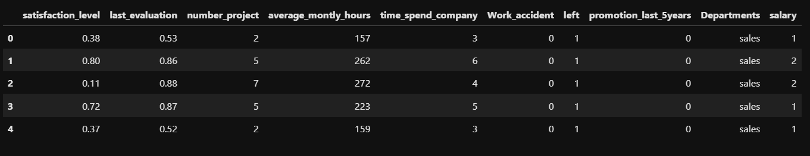

# Implementation-of-Decision-Tree-Classifier-Model-for-Predicting-Employee-Churn

## AIM:
To write a program to implement the Decision Tree Classifier Model for Predicting Employee Churn.

## Equipments Required:
1. Hardware – PCs
2. Anaconda – Python 3.7 Installation / Jupyter notebook

## Algorithm


## Program:
```
/*
Program to implement the Decision Tree Classifier Model for Predicting Employee Churn.
Developed by: Nanda Kishor S P
RegisterNumber: 212224040210
*/
```

```python
# Import necessary libraries
import pandas as pd
from sklearn.model_selection import train_test_split
from sklearn.preprocessing import LabelEncoder
from sklearn.tree import DecisionTreeClassifier
from sklearn.metrics import accuracy_score, confusion_matrix, classification_report
import seaborn as sns
import matplotlib.pyplot as plt
```

```python
# Load the dataset
data = pd.read_csv(r"C:\Users\nanda\Downloads\Employee.csv")
```

```python
# Display info
data.info()
```

```python
# Check for missing values
data.isnull().sum()
```

```python
# Check target distribution
data['left'].value_counts()
```

```python
# Encode 'salary' column
le = LabelEncoder()
data['salary'] = le.fit_transform(data['salary'])
```

```python
# Define features and target (dropping 'Departments' and 'left')
X = data.drop(['left','Departments '], axis=1)
y = data['left']
```

```python
# Split into train and test sets
x_train, x_test, y_train, y_test = train_test_split(X, y, test_size=0.2, random_state=100)
```

```python
# Train Decision Tree Classifier
dt = DecisionTreeClassifier(criterion='entropy', random_state=100)
dt.fit(x_train, y_train)
```

```python
# Predict on test set
y_pred = dt.predict(x_test)
```

```python
# Evaluate the model
accuracy = accuracy_score(y_test, y_pred)
print(f"Accuracy: {accuracy*100}%")
```

```python
print("Classification Report:")
print(classification_report(y_test, y_pred))
```

```python
print("Confusion Matrix:")
cm = confusion_matrix(y_test, y_pred)
print(cm)
```

```python
# Visualize Confusion Matrix
plt.figure(figsize=(6, 4))
sns.heatmap(cm, annot=True, fmt='d', cmap='Blues', xticklabels=['Stayed', 'Left'], yticklabels=['Stayed', 'Left'])
plt.xlabel('Predicted')
plt.ylabel('Actual')
plt.title('Confusion Matrix')
plt.show()
```

```python
# Predict for a new sample
sample = pd.DataFrame([[0.5, 0.8, 9, 260, 6, 0, 1, 2]], columns=X.columns)
sample_pred = dt.predict(sample)
print(f"Prediction for sample input: {'Left' if sample_pred[0] == 1 else 'Stayed'}")
```

## Output:

#### Data info
  

#### Head Values
  

#### Missing Values
  

#### Target Value Distribution
  

#### Training the Model
  

#### Classification Report
  

#### Confusion Matrix
  
  

#### Model Prediction for new Sample
  

## Result:
Thus the program to implement the  Decision Tree Classifier Model for Predicting Employee Churn is written and verified using python programming.
